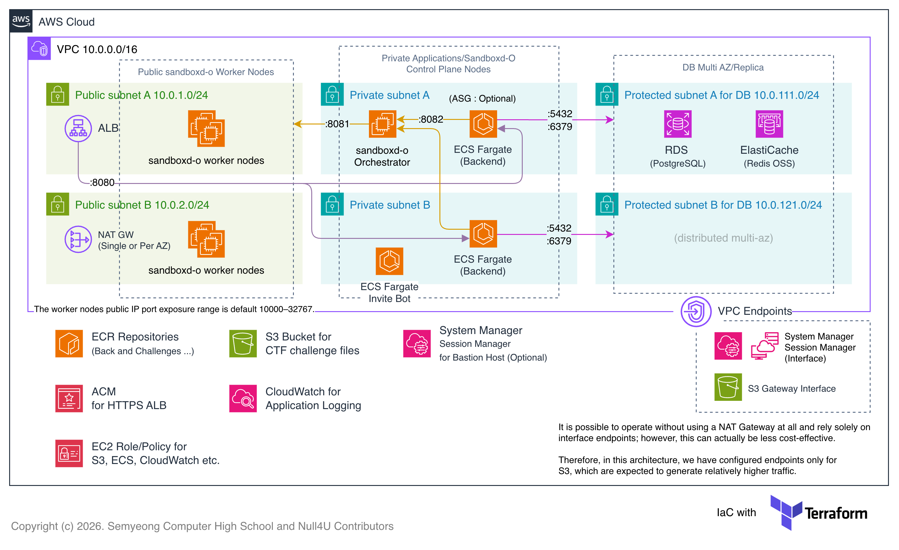

# Infrastructure for SMCTF v2

See [SMCTF Docs](https://github.com/nullforu/smctf-docs) for more information about SMCTF and how to use this repository.

## AWS Architecture Diagram



## Sandboxd-O Cluster

```
VPC_ID=$(terraform output -raw vpc_id)
PUBLIC_SUBNET_IDS=$(terraform output -json public_subnet_ids | jq -r '.[]' | paste -sd, -)
PRIVATE_SUBNET_IDS=$(terraform output -json private_subnet_ids | jq -r '.[]' | paste -sd, -)

VPC_ID='vpc-0e4c45fa4c022dca0'
PUBLIC_SUBNET_IDS='subnet-0904b6365d94ee2e9,subnet-0899a850e8bb26c97'
PRIVATE_SUBNET_IDS='subnet-043a08c2d6771fe27,subnet-02fed606fe54b9e56'

sbxadm create cluster smctf-cluster \
  --profile smc12 \
  --version 0.4.0 \
  --vpc-id ${VPC_ID} \
  --public-subnet ${PUBLIC_SUBNET_IDS} \
  --private-subnet ${PRIVATE_SUBNET_IDS} \
  --region ap-northeast-2 \
  --orch-instance t3.xlarge \
  --orch-public-endpoint \
  --orch-root-volume-size 16Gi \
  --shared-secret c8aca162b97e2dc158a8568049dcab31040461bb21bb19139e910df2b7583534

sbxadm create worker smctf-worker-1 \
  --profile smc12 \
  --cluster smctf-cluster \
  --version 0.4.0 \
  --instance t3.xlarge \
  --root-volume-size 64Gi \
  --ecr-repos "*"

sbxadm update-sbxctl-config smctf-cluster --profile smc12
```
